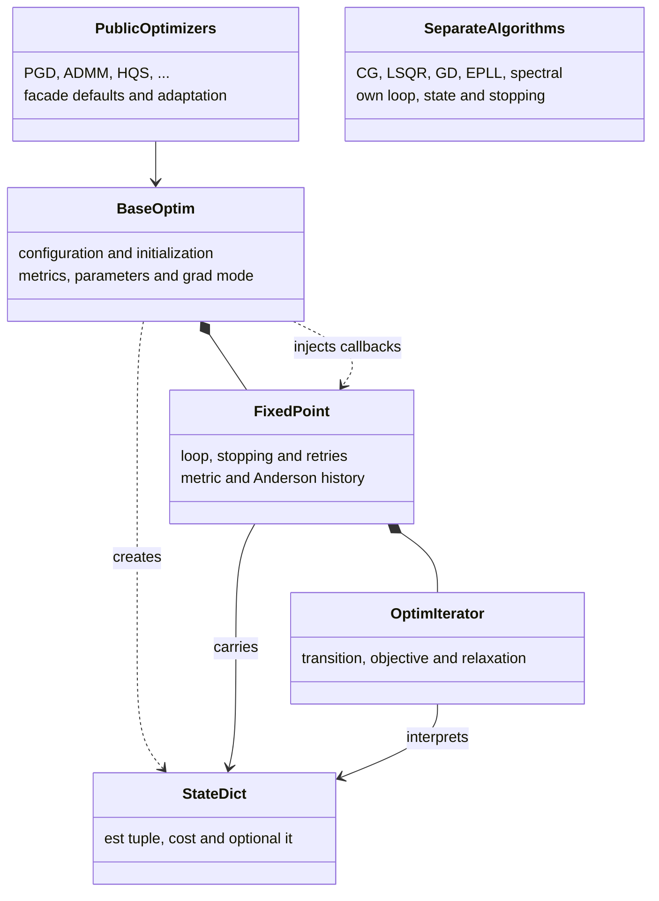
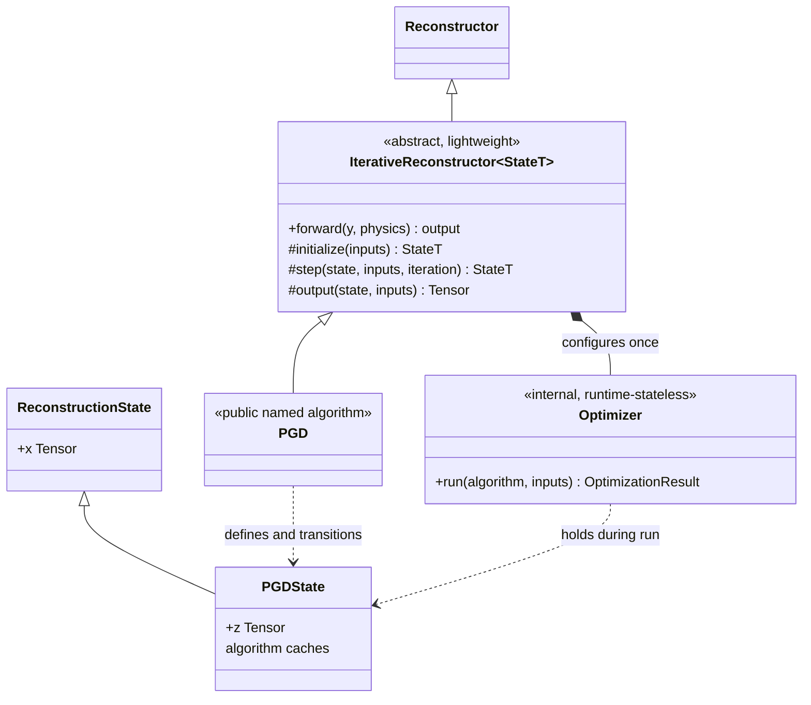

# DeepInv iterative optimization refactor: architecture

> Draft 0.4 for maintainer discussion  
> Scope: target architecture only; compatibility and migration are deferred.

**Design goals:**

- named reconstructors such as `PGD`, `ADMM` and `CG` inherit one lightweight iterative-reconstructor base
- one loop, with no separate numerical iterator
- a nearly cost-free path for fixed-step algorithms
- a minimal common reconstruction state, extended by colocated algorithm-specific state
- one central history per run, shared by metrics, stopping and progress
- optional behavior through small fixed interfaces, without feature flags in the loop
- unsupported objectives and physics fail at the public boundary, before iteration starts
- future stochastic optimization algorithms fit without involving `deepinv.sampling`

## 1. Ownership before and after

Current implementation (simplified):



Proposed inheritance and ownership:



There is no public `PGDIteration` paired with `PGD`: the named child class directly implements the numerical contract inherited from `IterativeReconstructor`.

## 2. Public algorithm and execution flow

```text
PGD.__call__(y, physics)
    -> IterativeReconstructor.forward        inherited public lifecycle
        -> Optimizer.run(self, inputs)        the only loop
            -> PGD.initialize / step / output
```

`IterativeReconstructor` is the lightweight common base: it declares the numerical methods, constructs the internal optimizer and implements `forward`. It does not implement another loop or interpret algorithm state. `PGD`, `ADMM`, `HQS`, `CG`, etc. inherit it and implement the mathematics directly.

Conceptually:

```text
StateT = TypeVar("StateT", bound=ReconstructionState)

class IterativeReconstructor(Reconstructor, Generic[StateT], ABC):
    def __init__(self, *, max_iter, metrics=(), stop=None,
                 history=None, callbacks=(), step_strategy=None):
        super().__init__()
        self.optimizer = Optimizer(
            max_iter=max_iter, metrics=metrics, stop=stop,
            history=history, callbacks=callbacks,
            step_strategy=step_strategy,
        )

    def forward(self, y, physics, ...):
        inputs = self.prepare_inputs(y, physics, ...)
        self.validate_inputs(inputs)
        result = self.optimizer.run(self, inputs)
        return self.present(result)

    @abstractmethod
    def initialize(self, inputs) -> StateT: ...

    @abstractmethod
    def step(self, state: StateT, inputs, iteration: int) -> StateT: ...

    def output(self, state: StateT, inputs):
        return state.x

class PGD(IterativeReconstructor[PGDState]):
    def initialize(self, inputs) -> PGDState: ...
    def step(self, state, inputs, iteration) -> PGDState: ...
```

The named class and its optional behavior are fixed when it is instantiated. Per-call values are reconstruction inputs such as `y`, `physics`, an initialization and observation-only references such as `x_gt`; a call does not replace components.

## 3. Algorithm and optimizer contracts

The minimum algorithm contract remains:

```text
initialize(inputs) -> StateT
step(state, inputs, iteration) -> StateT
output(state, inputs) -> Output
```

There are two precise ownership statements:

- the named algorithm owns the **state schema and semantics**: it defines, constructs and interprets `StateT`
- the active `Optimizer.run` call owns the **live state instance and its lifetime**: it holds the current reference and replaces it with the value returned by `step`

No other common code may interpret that instance.

| Part | Owns | May use but never interpret |
|---|---|---|
| Base reconstructor | public lifecycle, fixed optimizer configuration and the common `x` state contract | child-state fields |
| Named algorithm | parameters/modules, objective structure, state schema, numerical transition and algorithm-specific validation | optimizer result |
| `Optimizer` configuration | maximum steps and fixed metric, stopping, history, callback and strategy configuration | algorithm configuration |
| Active `Optimizer.run` | live current/previous state references, iteration counter, optional strategy scratch and observation history | the contents of algorithm state |
| Algorithm state | current reconstruction plus numerical memory/caches required by a future transition | observation history and callback state |
| `OptimizationResult` | output, history, accepted step count and stop reason | final state only if explicitly exposed |

`Optimizer` is runtime-stateless between calls: after `run` returns it retains no current state, history, convergence flag or last result.

### Common and algorithm-specific state

All reconstruction states share one small contract:

```text
@dataclass(frozen=True)
class ReconstructionState:
    x: Tensor                      # current public reconstruction

@dataclass(frozen=True)
class PGDState(ReconstructionState):
    z: Tensor | None               # only if the PGD variant needs it

@dataclass(frozen=True)
class CGState(ReconstructionState):
    residual: Tensor
    direction: Tensor
    residual_norm_squared: Tensor
```

- `x` is defined once and supports a default `output(state) -> state.x`.
- The optimizer iteration counter belongs to `Optimizer.run` and `IterationRecord`, not every algorithm state.
- A child state adds only values needed to compute a later transition: dual variables, momentum, residuals, sufficient statistics or per-call caches.
- Immutable values derived once from `y` or `physics`, such as an MLEM sensitivity map, belong in prepared run inputs; only evolving numerical memory belongs in state.
- A value already computed for the mathematics may also be extracted as a metric; it is not duplicated in a generic `info` dictionary.
- State classes are colocated with their algorithms and are private unless checkpointing or an advanced API makes them public.
- Transitions are out-of-place. Unchanged tensors may be shared.

The four kinds of retained data are deliberately separate:

```text
Optimizer.run locals
├── current + previous StateT       only around one accepted transition
├── strategy scratch               e.g. Anderson window or backtracking trials
├── IterationRecord                transient shared observation view
└── History                        requested retained outputs/metrics

StateT
└── numerical memory required by the algorithm's next step
```

If L-BFGS, momentum or a stochastic estimator needs previous values to define the next iterate, that memory is part of its typed algorithm state. If Anderson is attached as an optional wrapper, its window is strategy scratch. If a user requests past reconstructions for analysis, detached snapshots belong to `History`. These cases do not share storage merely because all involve the past.

## 4. History, metrics, stopping and callbacks

History is a first-class run result, not incidental storage owned independently by several observers. Its container is common—an append-only collection of named series—but its fields are intentionally algorithm- and configuration-dependent.

The optimizer creates one transient `IterationRecord` for an accepted state:

```text
IterationRecord(
    iteration,
    previous_state,     references only
    state,              references only
    output,             evaluated lazily and at most once
    values,             named metrics evaluated at most once
)
```

All observation-side behavior shares that record:

```text
accepted state
    -> evaluate due metrics once
    -> append requested values to the single History
    -> run progress/logging/checkpoint callbacks
    -> evaluate the stopping rule
```

The final accepted state is therefore recorded before it can stop the run.

The interfaces have distinct jobs:

```text
Metric.evaluate(algorithm, record, inputs) -> named value
StopRule.check(record, history) -> StopDecision
Callback.on_step(record, history) -> None
Cadence(record) -> bool
```

- A **metric** computes a value but stores nothing.
- **History** is the only retained metric/iterate storage. Its fixed policy selects fields and cadence and defines detaching or device transfer explicitly.
- A **callback** performs a side effect such as progress display, logging or checkpointing. It reads the same values rather than recomputing them.
- A **stopping rule** reads the current record and, when needed, the central history. Batch reduction (`all`, `any`, mean, maximum, etc.) is part of that rule.
- A **cadence** is a predicate attached to a metric, history field, callback or stop rule. It can be step-based or inspect an algorithm-specific state.

Metric names are unique in one optimizer configuration. Shared essentials such as the public output and residual are computed once in the record and reused. History stores only requested values; consumers do not each retain copies of the state or metric arrays.

History does not store full states by default. A requested iterate series stores snapshots of `record.output`, with an explicit detach/copy/device policy. Numerical fields already present in a typed state are exposed through metric extractors and copied at most once into history.

The default fixed-iteration run creates no history. Enabling a progress bar does not silently enable metrics, and enabling stopping requests only the values its rule needs.

## 5. Transition-changing strategies

Backtracking and Anderson acceleration remain optional, generic strategies configured with the named algorithm. The optimizer selects one transition callable before entering the loop:

```text
StepStrategy.transition(
    algorithm, state, inputs, iteration, scratch
) -> state, scratch
```

The default transition is the direct call to `algorithm.step`. Strategy scratch is a local variable of `Optimizer.run`, initialized only when required and discarded after the run. It does not require a public component/session hierarchy.

Generic does not mean compatible with every algorithm:

- backtracking requires a narrow proposal/merit capability from the algorithm
- Anderson requires a fixed-point view of the state and a way to rebuild a valid state
- compatibility is checked once when the named algorithm constructs its optimizer
- neither strategy mutates persistent algorithm parameters or discovers behavior through state-dictionary keys

Their reusable implementation belongs beside `Optimizer`; the mathematical adapters belong on the algorithms that support them.

## 6. Problem compatibility and objective multiplicity

The base optimizer knows nothing about `f`, `g`, priors, potentials or physics. Each named algorithm declares and validates its own problem contract at the public boundary.

The public signature communicates cardinality:

- a singular type means exactly one or at most one term
- an `Iterable[...]` or deliberately plural argument means the algorithm supports several terms
- a class should not accept the universal `Term | Iterable[Term]` merely for convenience

For example, MLEM hardcodes the Poisson multiplicative update. It should expose a singular Poisson fidelity, not silently accept arbitrary fidelities or an iterable:

```text
class MLEM(IterativeReconstructor[MLEMState]):
    def __init__(
        self,
        data_fidelity: PoissonLikelihood | None = None,
        prior: Prior | None = None,
        ...,
    ):
        self.data_fidelity = require_type(
            data_fidelity or PoissonLikelihood(),
            PoissonLikelihood,
            name="MLEM data_fidelity",
        )
        self.prior = require_optional_capability(prior, "grad")
```

Passing three fidelities to MLEM then raises a clear `TypeError` in its constructor. It never reaches the first call to `step`. If a fidelity is used only to evaluate a diagnostic rather than define the MLEM transition, that role should be named as a metric instead of pretending it is the optimized fidelity.

Validation has four independent parts:

| Constraint | Checked where | Example |
|---|---|---|
| cardinality | constructor | MLEM: one fidelity; PGD: one proximal prior |
| required operation | constructor | GD needs `grad`; ADMM needs `prox` |
| nominal mathematical family | constructor | MLEM requires Poisson likelihood |
| input/physics compatibility | `prepare_inputs` / `validate_inputs` | OSEM requires supported tomography/PET physics and matching subsets |

Type hints and documentation guide users, but runtime validation is mandatory because Python does not enforce annotations. Small shared helpers normalize terms and produce consistent errors; the actual rules remain ordinary code on the named algorithm rather than a global capability registry.

Operation checks must use an explicit support declaration or an algorithm-specific predicate, not `hasattr`. `Potential` currently provides fallback methods whose presence does not prove that an implicit prior meaningfully supports them. A minimal `term.supports("grad")` / `term.supports("prox")` contract would make errors early and reliable without introducing objective wrappers.

Algorithms that truly support multiple terms accept ordinary iterables and register them as a `ModuleList` or tuple. The named class must document whether terms are added, split, composed or selected and how their inputs and weights are paired.

For gradient descent on $F=f_1+f_2$, one transition is:

```text
class GradientDescent(IterativeReconstructor[GDState]):
    def __init__(self, data_fidelities: Iterable[DataFidelity], ...):
        self.data_fidelities = require_terms(
            data_fidelities, min_count=1, capability="grad"
        )

    def step(self, state, inputs, iteration):
        gradient = sum(
            f.grad(state.x, term_input.y, term_input.physics)
            for f, term_input in zip(self.data_fidelities, inputs.terms, strict=True)
        )
        return GDState(x=state.x - self.stepsize(iteration) * gradient)
```

This is **one step using the summed gradient**, not one sequential step on each term. Incremental or sampled term updates belong to a different named algorithm such as `SGD`; receiving an iterable must never switch semantics implicitly.

Further rules remain algorithm-owned:

- `PGD` may eventually sum several differentiable fidelities but still accept only one proximal prior.
- Multiple proximal priors require explicit splitting, such as a primal-dual or consensus algorithm.
- A PnP prior can satisfy a proximal/update requirement without claiming an objective value.
- Preserving the current single-`f`, single-`g` contract during the refactor is not a regression.

No generic objective-expression language is required, and an iterable of objective terms never means “use a different term at each iteration.”

## 7. Future stochastic optimization algorithms

This section concerns future reconstruction algorithms such as SGD, SAGA or SVRG. The existing `deepinv.sampling` package is unrelated to this refactor and remains entirely out of scope.

A future `SGD` class implements the same three methods and runs through the same optimizer. Random selection and estimator-specific memory stay internal to `SGD`; no sampling policy, RNG or dataset abstraction is added to the optimizer.

One optimizer step means one call to the algorithm's `step`:

- for SGD this will usually be one sample or minibatch update
- for an ordered-subset algorithm it may be one subset update
- an existing algorithm may retain one complete subset sweep per step when that is its natural compatibility boundary

When substeps must be grouped into epochs, the algorithm state carries the necessary counters:

```text
SGDState(x, epoch, batch_index, samples_seen, estimator_memory, ...)
OSEMState(x, epoch, subset_index, ...)
```

An epoch-aware cadence or stopping rule receives the previous and current typed states through `IterationRecord`; for example, an epoch boundary is `state.epoch > previous_state.epoch`. The optimizer does not know what an epoch or subset is.

The stopping **interface** is therefore the same for deterministic and stochastic algorithms. The configured rule and cadence differ:

- deterministic residual stopping may run after every transition
- noisy criteria may use a rolling value in central history
- expensive full-objective metrics and stopping may run only at epoch boundaries
- batch reduction remains explicit in the stop rule

Stochastic algorithms are not implemented in this refactor. The acceptance requirement is only that the core loop, typed state and observation cadence do not prevent them later.

## 8. Extension map for common and future features

The architecture should not predict every optimization method, but it should give a stable home to recurring concerns. The placement rule is based on how a feature affects a run:

| Feature category | Owner / extension point | Examples |
|---|---|---|
| defines the mathematical next state | named algorithm and its typed state | momentum, FISTA extrapolation, quasi-Newton memory, stochastic estimators, primal/dual variables |
| wraps or retries a compatible transition | `StepStrategy` plus a narrow algorithm capability | backtracking, Anderson, damping, adaptive restart |
| varies an algorithm parameter | algorithm-owned schedule helper | stepsize, regularization weight, denoiser level, relaxation |
| reads accepted states | metric, stopping rule, callback or history policy | residuals, cost, progress, logging, checkpoints |
| solves an inner problem | child `IterativeReconstructor` owned by the algorithm | CG inside ADMM/HQS, iterative proximal calls |
| prepares or restricts a problem | named algorithm validation/preparation hooks | subset construction, sensitivity maps, SIRT normalizers, physics checks |

An iteration-dependent parameter can use a shared value-or-callable helper without becoming runner logic:

```text
stepsize = resolve(self.stepsize, iteration=iteration, state=state)
```

The loop does not gain a new branch when a new feature fits one of these categories. A new core extension point is justified only when a reusable concern cannot be expressed cleanly through them. Small capability protocols may be added for compatible algorithm families without imposing their fields on every state.

## 9. Fast path

With no optional behavior, `Optimizer.run` reduces to:

```text
state = algorithm.initialize(inputs)
for iteration in range(max_iter):
    state = algorithm.step(state, inputs, iteration)
return OptimizationResult(
    output=algorithm.output(state, inputs),
    iterations=max_iter,
    stop_reason="max_iter",
)
```

This path allocates no history or iteration records, evaluates no metric or objective, performs no convergence synchronization, and contains no sampling, stopping, acceleration or progress branch.

## 10. Representative mappings

| Named algorithm | State and transition ownership | Optional behavior |
|---|---|---|
| `GradientDescent` | `GDState(x)`; algorithm-defined gradient aggregation | optional residual metric/stop |
| `ConjugateGradient` | `CGState(x, r, p, rr, bnorm, ...)`; one CG transition | residual stop reproduces the current default |
| `PGD` / `FISTA` | colocated primal/auxiliary state; complete algorithm step replaces the current iterator | metrics, backtracking or compatible Anderson strategy |
| `ADMM` / `HQS` | colocated primal/dual state and complete transition | independent inner `CG` call when required |
| `OSEM` | image and subset/epoch counters at its chosen transition granularity | epoch-aware history or stopping cadence |
| `EPLL` / spectral | their own state and complete transition | shared lifecycle without forcing a splitting abstraction |
| future `SGD` | reconstruction and estimator/counter state; one minibatch transition | epoch-aware metrics/history/stop |

## 11. Decisions established by this proposal

- Public named algorithms inherit `IterativeReconstructor[StateT]` and directly implement `initialize`, `step` and `output`; there is no paired iterator.
- The base owns `forward` and fixed optimizer construction but no numerical loop.
- The algorithm owns its state schema; the active run owns live state instances/history; the reusable optimizer retains neither.
- Every out-of-place state inherits `ReconstructionState(x)` and adds only transition-relevant fields.
- `Optimizer` creates the result; the named class presents `output` or compatible `(output, info)` forms.
- Metrics compute, one history stores, callbacks perform side effects, and stopping decides; stochastic rules may use different cadences.
- Backtracking and Anderson are strategies; public validation rejects unsupported problems before the loop.
- Stochastic optimization and specialized differentiation remain outside this refactor; normal autograd still works.

## 12. Architecture acceptance checks

- The path is named algorithm → inherited `forward` → `Optimizer.run` → the same algorithm's numerical methods; `PGDIteration` disappears.
- The active run carries state but never interprets child fields, and nested/reused runs leak no mutable data.
- State types share only `x`; numerical memory remains colocated and typed.
- Metrics are computed once and one history owns retained observation data.
- Unsupported MLEM fidelities fail early; multi-term algorithms state their capabilities and aggregation/splitting semantics.
- Future stochastic/features fit the placement rules without sampling concepts, speculative state fields or fast-path branches.
